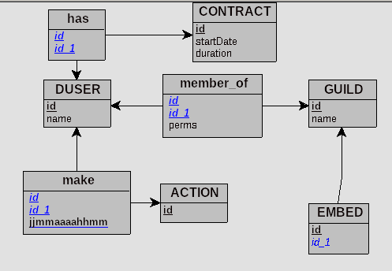

# 5pybot

## Description

<p style="color:red;">the api is still in development</p>

An esport utility discord bot,
this is the backend api for the bot itself please see [the other github](https://github.com/5pyTeam/5pybot)

## Documentation

All i have to say is that the database schema is the following


## Installation

```bash
$ yarn install
```

## Running the app

```bash
# development
$ yarn start

# watch mode
$ yarn start:dev

# production mode
$ yarn start:prod
```

## Test

```bash
# unit tests
$ yarn test

# test coverage
$ yarn test:cov
```

## Support

I'm currently the only maintainer of the project and I am always looking for new contributors.

## Stay in touch

- Author - [Zbinden Yohan](https://twitter.com/yoyozbi)
- Website - Coming soon !!

## License

5pybot-api is GPL-V3 licensed.
